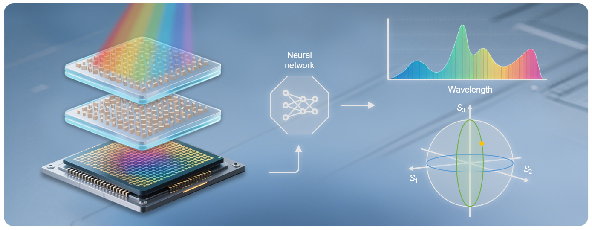

# DON-SP

## Abstract
Conventional spectrometer and polarimeter systems rely on bulky optics, limiting compact integration and hindering multi-dimensional optical sensing capabilities. Here, we propose a spectropolarimeter enabled by metasurface-based diffractive optical networks that simultaneously perform spectrometric and polarimetric measurements in a compact device. By leveraging the wavelength- and polarization-dependent phase modulation of metasurfaces, our system encodes the spectral and polarization information of incident light into spatially resolved intensity distributions, which are decoded by a co-designed deep neural network, enabling simultaneous high-accuracy reconstruction of spectral compositions and Stokes parameters through a single-shot measurement. Experiments validate the method’s accurate reconstruction of the spectral and polarization information across a broad wavelength range, and further confirm its imaging capability. Notably, we demonstrate a chip-integrated sensor prototype combing both measurement functionalities into a commercial image sensor. This integrated platform provides a compact solution for on-chip multi-dimensional optical sensing, holding potential for versatile sensing, biomedical diagnosis, and industrial metrology.

